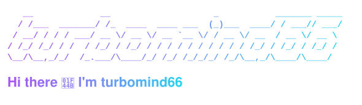
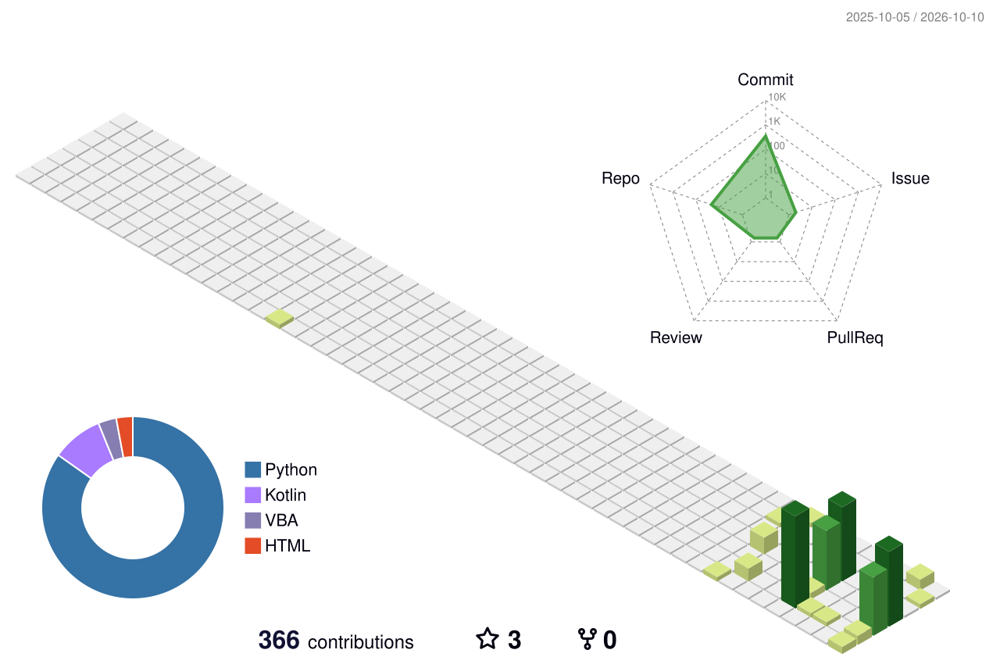

<div align="center">



</div>


## 🖥️ Whoami

```text
$ whoami
turbomind66 — 审计 AI 助手 builder / 全栈自动化爱好者

$ cat focus.txt
把繁琐的审计流程，用 AI 和自动化跑起来 🤖

$ ls skills/
Python/  Go/  Node.js/  网关逆向/  审计数字化/
```

## 🧰 Tech Stack
[](https://skillicons.dev)

## 🚀 Featured Projects

<table>
  <tr>
    <td width="50%" align="center">
      <a href="https://github.com/turbomind66/excel-vba-round-selected-cells">
        
      </a>
    </td>
    <td width="50%" align="center">
      <a href="https://github.com/turbomind66/word-vba-two-decimal-format">
        
      </a>
    </td>
  </tr>
  <tr>
    <td colspan="2" align="center">
      <a href="https://github.com/turbomind66/workbuddy2api-python">
        
      </a>
    </td>
  </tr>
</table>

## 👀 Visitor Count


## 📊 GitHub Stats

<table>
  <tr>
    <td width="50%" align="center">
      
    </td>
    <td width="50%" align="center">
      
    </td>
  </tr>
</table>

## 🔥 Streak & 🏆 Trophies

<div align="center">

[](https://streak-stats.demolab.com/?user=turbomind66)
<br/>


</div>

## 🐍 Contribution Snake


## 🌐 3D Contribution Globe


## 💡 Quote of the Day

<div align="center">


</div>


---

